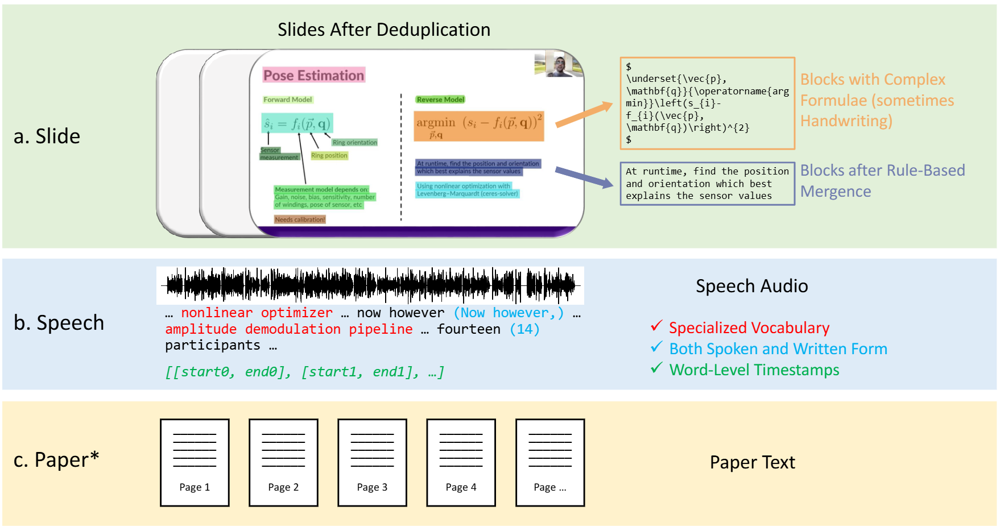

# 🎓M3AV: A Multimodal, Multigenre, and Multipurpose Audio-Visual Academic Lecture Dataset (ACL 2024)

  [**📄Paper**](https://arxiv.org/abs/2403.14168) | [**🏠️Homepage**](https://jack-zc8.github.io/M3AV-dataset-page/) | [**📥Download**](./download/) | [**💎Demo**](./demo/) | [**🤖Benchmarks**](./benchmarks/) 

## Overview

The overview of our 🎓M3AV dataset:
1. The first component is slides annotated with simple and complex blocks. They will be merged following some rules.
2. The second component is speech containing special vocabulary, spoken and written forms, and word-level timestamps.
3. The third component is the paper corresponding to the video. The asterisk (*) denotes that only computer science videos have corresponding papers.

| Video Field                | Video Name                                                                                     | Total Hours | Total Counts |
| -------------------------- | -------------------------------------------------------------------------------------------------------------- | ----------- | ------------ |
| Human-computer Interaction | [CHI 2021 Paper Presentations](https://www.youtube.com/playlist?list=PLqhXYFYmZ-Vez20PWol8EVmJDmpr9DdPG) (CHI) | 55.00       | 660          |
| Human-computer Interaction | [UbiComp 2020 Presentations](https://www.youtube.com/playlist?list=PLqhXYFYmZ-Ve-5VzhGv6RqR22_qnNZX1Y) (Ubi)   | 10.65       | 107          |
| Biomedical Sciences        | [NIH Director's Wednesday Afternoon Lectures](https://www.youtube.com/playlist?list=PL1F9CE65D2F87D4A7) (NIH)  | 237.71      | 228          |
| Biomedical Sciences        | [Introduction to the Principles and Practice of Clinical Research](https://www.youtube.com/playlist?list=PLifjiEBb2Zq7ruvGhgyD2jDsgoaD3p6d4) (IPP)                        | 42.27       | 67           |
| Mathematics                | [Oxford Mathematics](https://www.youtube.com/@OxfordMathematics/videos) (MLS)                                  | 27.23       | 51           |

We download various academic lectures ranging from Human-computer Interaction, and Biomedical Sciences to Mathematics as shown in the table above.

## News

- [2024-08] 🤖All Benchmarks have been released!
- [2024-06] 🤖Benchmarks of LLaMA-2 and GPT-4 have been released!
- [2024-05] 🎉Our work has been accepted by ACL 2024 main conference!
- [2024-04] 🔥v1.0 has been released! We have further refined all speech data. Specifically, the training set adopts the text-normalised Whisper results, and the development/testing set employs a manual combination of Whisper and microsoft STT results.

## Details

The folder [demo](./demo/) contains a sample for demonstration.

