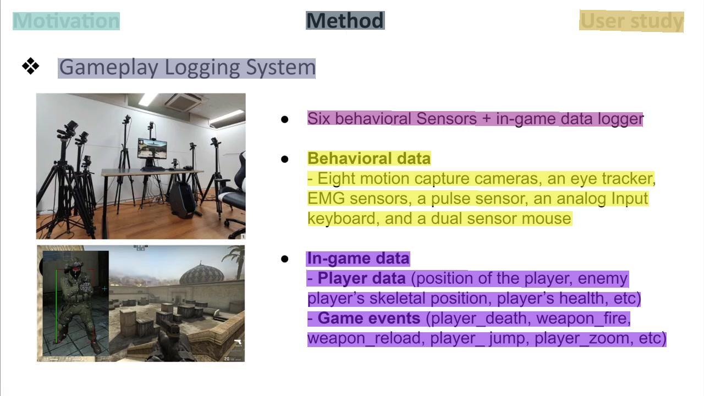

# A sample for demonstration

## Raw

### `raw/*.mp4.ytbUrl`

It contains the URL to the original YouTube video.

## OCR

<p align="left">

</p>

### `ocr/ocr_result.json`
```json
[
  ...,
  { 
    "check": "paddleocr+check",
    "name": "CHI-473DF-0183000.jpg",
    "ocr_data": [
      {
        "index_in_para": 0,
        "index_para": 0,
        "points": xxx,
        "transcription": "User study"
      },
      {
        "index_in_para": 0,
        "index_para": 1,
        "points": xxx,
        "transcription": "Method"
      },
      {
        "index_in_para": 0,
        "index_para": 2,
        "points": xxx,
        "transcription": "Motivation"
      }
    ]
  },
  ...
]
```
- `check` may be `paddleocr+check` or `mathpix+check`, indicating the method of checking OCR annotation.

- `name` is the name of the image (all images are stored in `ocr/seg_imgs/`), which contains the timestamp information.

- `ocr_data` is the OCR data.
  
  - `index_in_para` is the index of the block in a paragraph.
  
  - `index_para` is the index of the paragraph. 
  
  - `points` is xy coordinate of the block, formed as a polygon.
  
  - `transcription` is the text of the block.


### `ocr/seg_speech_ocr.json`
```json
[
  ...,
  {
    "check": "paddleocr+check",
    "name": "CHI-473DF-0051500.jpg",
    "ocr_text": "Why First Person Shooters?\nFast reaction,\nAccurate aiming, ...\nCombat skills\n\"Gosu\"\nHow the player performs better?",
    "speech_text": "The first-person shooter, called FPS, requires very fast reaction time to check the opponent's position, and the user has to aim the opponent accurately using their mouse. Like this, the individual's combat skills has a very huge influence on the win or loss of the game. And as you know, professional players dominate the combat skills of normal players. We call them Gosu, not only professional players, but who has a much high performance. Then how and why the Gosu perform better than the other players?",
    "start": 15.45,
    "end": 51.5
  },
  ...
]
```
- `check` may be `paddleocr+check` or `mathpix+check`, indicating the method of checking OCR annotation.

- `name` is the name of the image (all images are stored in `seg_imgs/`), which contains the timestamp.

- `ocr_text` is the paragraph text that all OCR blocks have been merged to form.
  
- `speech_text` is the speech text (obtained by merging `words_written` in `speech/final+timestamps.json`) in this segment. We divide the segments according to the de-duplicated images (stored in `ocr/seg_imgs/`).
  
- `start` is the start timestamp of this segment.
  
- `end` is the end timestamp of this segment.

The generation process is detailed in `get_seg_speech_ocr.py`.

## Speech

### `speech/final+timestamps.json`

```json
[
  ...,
  {
    "timestr": "0116520_0124680",
    "final_spoken": "least one hundred thousand to over two million views we organized them into four categories aiming character movement",
    "final_written": "least 100,000 to over 2 million views. We organized them into four categories, aiming, character movement,",
    "words_spoken": [
      {
        "word": "least",
        "start": 116.64,
        "end": 116.89999999999999
      },
      {
        "word": "one",
        "start": 116.89999999999999,
        "end": 116.99
      },
      {
        "word": "hundred",
        "start": 116.99,
        "end": 117.45
      },
      {
        "word": "thousand",
        "start": 117.45,
        "end": 117.97999999999999
      },
      ...
    ],
    "words_written": [
      {
        "word": "least",
        "start": 116.64,
        "end": 116.88
      },
      {
        "word": "100,000",
        "start": 116.88,
        "end": 117.97
      },
      ...
  },
  ...
]
```

- `timestr` is the start and end timestamp of the segment.

- `final_spoken` is the spoken form of the speech transcription.

- `final_written` is the written form of the speech transcription.

- `words_spoken` and `words_written` are the word-level timestamps in the form of spoken and written, respectively. We perform alignment using [Montreal Forced Aligner](https://montreal-forced-aligner.readthedocs.io/en/latest/index.html#) to get more accurate timestamps.

## Paper

### `paper/paper_sentences.json`

```json
[
  ...,
  "Such skills include the ability to accurately shoot small, fast-moving enemies, incapacitate an enemy attack through unpredictable movement, and create a more manageable shooting situation in the game than the enemy.",
  ...
]
```

It contains a list of all sentences in the correspoding paper. Note that they only exists in Computer Science videos for they are the only ones with downloadable papers.